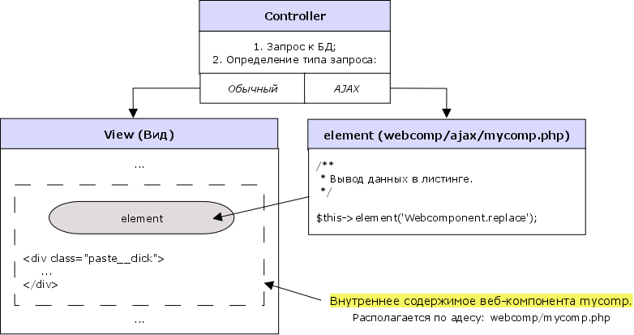
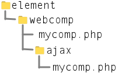

### Расширяемый веб-компонент Paginator.

Осуществляет пагинацию (разбивку на страницы) данных.

[Настройки.](#settings)

[Описание работы.](#description)

[Взаимодействие контроллёра, вида и элемента CakePHP из директории ajax.](#interaction)

[Создание файлов веб-компонента через терминал, в котором будет пагинация.](#terminal)

### <a id="settings">Настройки.</a>

Для использования функциональности расширяемого веб-компонента `Paginator` необходимо его импортировать (при помощи import) и унаследоваться от него.

```js
import from WEBROOT + '/js/ext/paginator/paginator.js';

class ИмяКласса extends Paginator {

    /**
     * Ваш код.
     */

    /**
     * Определяем, за какими атрибутами необходимо наблюдать.
     * 
     * @return array Массив атрибутов.
     */
    static get observedAttributes() {
        return [...super.observedAttributes, 'др. значения массива'];
    }

    /**
     * Следим за изменениями этих атрибутов и отвечаем соответственно.
     */
    attributeChangedCallback( name, oldVal, newVal ) {
        super.attributeChangedCallback( name, oldVal, newVal );
        /**
         * Ваш код.
         */
    }

    /**
     * Браузер вызывает этот метод при добавлении элемента в документ.
     * (может вызываться много раз, если элемент многократно добавляется/удаляется).
     */
    connectedCallback() {
        super.connectedCallback();
    }
}
```

Настройки (значения атрибутов):

* `eventnextpage` - событие для продолжение пагинации: `click` - щелчок (по умолчанию) и `visibility` - при появление в окне браузера.

Для работы пагинации необходимо подключить хелпер в файле `AppView.php`.

```php
// ./scr/View/AppView.php
public function initialize(): void
{
    $this->loadHelper('Paginator');
}
```

### <a id="description">Описание работы.</a>

При первой загрузке страницы ваш веб-компонент должен отдавать html-вёрстку:

```html
/**
 * Здесь выводится листинг html-вёрстки первой страницы пагинации.
 */

<div class="paste__replace">
    <input name="page" type="hidden" value="...url">
</div>

<div class="paste__click paginator__click button">
    <div class="text">Смотреть ещё...</div>
    <div class="paste__trubber">...</div>
</div>
```

Элемент с классом `paste__replace` будет заменён при каждом получении новой порции данных. Для продолжения пагинации необходимо, чтобы принятые данные содержали элемент с классом `paste__replace`. 

Если `eventnextpage=click` (установлен по умолчанию), то сразу за элементом `paste__replace` должен идти элемент, содержащий классы `paste__click` и `paginator__click`. На этот элемент навешивается событие `click`, которое будет продолжать пагинацию.

Элементы с классом `paste__click` и `paste__trubber` являются взаимоисключающие. Это значит, когда один элемент показывется - другой скрывается. В случае вставки последней страницы пагинации оба класса скрываются.

Класс `paginator__click` и `paste__click` для правильной работы должны находиться на одном элементе.

Для упрощения html-вёрстки веб-компонента с пагинацией, элемент с классом `paste__replace` заменяют элементом cakePHP:

```html
/**
 * Здесь выводится листинг html-вёрстки первой страницы пагинации.
 */

<?= $this->element('Webcomponent.replace') ?>

<div class="paste__click paginator__click button">
    <div class="text">Смотреть ещё...</div>
    <div class="paste__trubber">...</div>
</div>
```

Для `eventnextpage=visibility` элемент `paste__click` не нужен. Необходимо в вёрстку в самый конец добавить элемент-пустышку для отслеживания появления веб-компонента в окне браузера - `<div class="event-scroll"></div>`. 

```html
/**
 * Здесь выводится html-вёрстка первой страницы пагинации.
 */

<?= $this->element('Webcomponent.replace') ?>

    <div class="paste__trubber">...</div>
	<div class="event-scroll"></div>
</div>
```

### <a id="interaction">Взаимодействие контроллёра, вида и элемента CakePHP из директории ajax.</a>

Полная схема взаимодействия приведена ниже:



Контроллёр запрашивает данные из БД для формирования листинга и, взависимости от типа запроса (AJAX-запрос или обычный), передаёт их в вид (View) или использовать в качестве вида элемент CakePHP из директории `ajax`. 

Для определения типа запроса в самом низу метода (действия) контроллёра вставляют строчку:

```php
if ($this->request->is('ajax')) return $this->render('/element/webcomp/ajax/mycomp');
```

В виде (View) необходимо использовать ваш веб-компонент, который наследуется от расширяемого веб-компонента `Paginator`. Содержимое вашего веб-компонента должно сотоять из элемента CakePHP из директории `ajax` (это тот самый элемент CakePHP, указанный в схеме с правой стороны), а также обязательной html-вёрсткой для продолжения пагинации с классами `paste__click` и `paste__replace`. Ниже показано как будет выглядеть дерево файлов с элементами определяющими внутреннее содержимое вашего веб-компонента и одноимённого элемента для AJAX-запросов.



Здесь появилась новая директория `ajax`, содержащая элементы CakePHP для AJAX-запросов и имеющих одноимённое название с элементами, определяющими внутреннее содержимое веб-компонента.

### <a id="terminal">Создание файлов веб-компонента через терминал, в котором будет пагинация.</a>

Для упрощения создания веб-компонентов с пагинацией применяют команду в терминале:

```
$ bin/cake webcomp <name> -list
```

или применяем краткую команду:

```
$ bin/cake webcomp <name> -l
```

Также можно применить и другие параметры при необходимости:

```
$ bin/cake webcomp <name> -l -c
```

